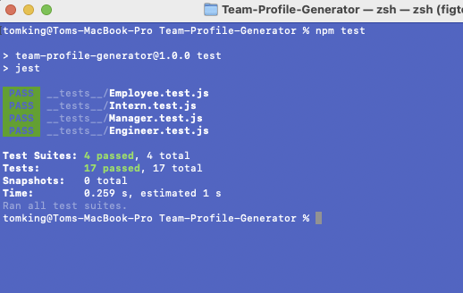

# Team Profile Generator 

## Description 
This application was created to generate a team profile based on user input using the Inquirer module from Node.js and displaying the information on a newly created html page with a style sheet. This project demonstrates use of OOP and TDD.
 
## Table of Contents
* [Installation](#installation)
* [Usage](#usage)
* [Screenshots](#screenshots)
* [License](#license)
* [Contributing](#contributing)
* [Tests](#tests)
* [Questions](#questions)

## Installation 
The user should clone the repository from GitHub and download Node.

This application uses several npm packages:

* inquirer - we have used inquirer version 8 for this project to enable the use of require over import
* jest
* path
* fs

## Usage 
1. Initialalise the application using the 'node index.js' command in the terminal (ensure you are in the correct folder)
2. Follow the onscreen prompts to enter the information about your team
3. Once completed a html file is written on the 'dist' folder called index.html
4. View the index.html file to see your team

## Screenshots

* NPM Testing  
  

* Application being used  
  
  

* index.html file example after completion of running application  

## License 
This project is license under MIT

## Contributing 
Contributors should read the installation section. 

## Tests
Run `npm test` to run Jest for tests on constructors.

## Questions
If you have any questions about this projects, please contact me directly at tomking151183@gmail.com You can view more of my projects at https://github.com/tomking1983.